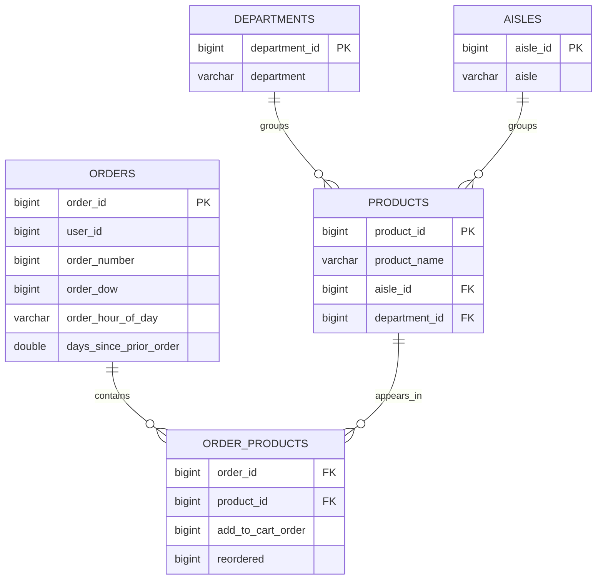

# Instacart SQL Analysis

An end-to-end SQL portfolio project exploring customer behaviour, product performance,
reorders, basket composition, and product affinity in more than 33 million grocery
order lines.

The project uses DuckDB as an analytical database and keeps every business question in
its own SQL file. The repository is designed to demonstrate both analytical SQL skills
and a reproducible data workflow.

## Project goals

The analysis answers 40 questions across six areas:

- dataset structure and scale;
- product and department performance;
- basket size and changes over time;
- customer activity and loyalty;
- reorder behaviour;
- product pairs, triples, and cart sequences.

The complete list of questions, techniques, results, and conclusions is available in
the [SQL query catalog](docs/query_catalog.md).

## Dataset

Source: [Instacart Online Grocery Basket Analysis Dataset on Kaggle](https://www.kaggle.com/datasets/yasserh/instacart-online-grocery-basket-analysis-dataset/data).

The source data is not committed to this repository. Download and extract these files
into `data/raw/`:

```text
aisles.csv
departments.csv
orders.csv
products.csv
order_products__prior.csv
order_products__train.csv
```

After loading, the local database contains:

| Entity | Rows |
|---|---:|
| Users | 206,209 |
| Orders | 3,421,083 |
| Combined order-product rows | 33,819,106 |
| Products | 49,688 |
| Aisles | 134 |
| Departments | 21 |

The figures above describe the supplied dataset and are reproduced by the setup and
analysis queries.

## Data model



`order_products` is built as the union of the provided prior and training order-product
files. Test orders do not have product-level labels in the source dataset.

## Skills demonstrated

- joins across a normalized analytical model;
- aggregation, grouping, filtering, and conditional segmentation;
- common table expressions and reusable intermediate results;
- window functions including `RANK`, `DENSE_RANK`, `ROW_NUMBER`, `LAG`, `LEAD`,
  `PERCENT_RANK`, and rolling windows;
- market basket and sequence analysis with self-joins;
- data-quality checks for nulls, keys, domains, and referential integrity;
- reproducible loading and automated execution with DuckDB and Python.

## Repository structure

```text
.
├── docs/
│   └── query_catalog.md
├── notebooks/
│   ├── 01_load_and_explore.ipynb
│   ├── 02_data_quality.ipynb
│   └── 03_data_analytics.ipynb
├── scripts/
│   ├── build_database.py
│   └── run_all_queries.py
└── sql/
    ├── create_tables.sql
    ├── dataset_overview/
    ├── product_performance/
    ├── basket_behavior/
    ├── customer_behavior/
    ├── reorder_analysis/
    └── market_basket_analysis/
```

## Run the project

Requirements: Python 3.11 or newer and the six Kaggle CSV files listed above.

```bash
python3 -m venv .venv
source .venv/bin/activate
python -m pip install -r requirements.txt
mkdir -p data/raw
# Download the six Kaggle CSV files into data/raw before continuing.
python scripts/build_database.py
python scripts/run_all_queries.py
jupyter lab
```

Run the notebooks in numeric order. Each notebook discovers the project root rather
than relying on the directory from which Jupyter was started.

The build script creates `instacart.duckdb` locally. Raw data, the database, virtual
environments, and notebook checkpoints are excluded from Git.

## Notes on interpretation

- A reorder rate is the average of the binary `reordered` field.
- Queries 37 and 38 use explicit order-ID samples because exhaustive pair and triple
  self-joins grow rapidly; their results must not be interpreted as full-dataset
  estimates.
- Null `days_since_prior_order` values are expected for each user's first order.
- Counts described as purchases represent order-product rows, not revenue; the dataset
  does not include prices.

## Technology

DuckDB SQL · Python · pandas · Jupyter
